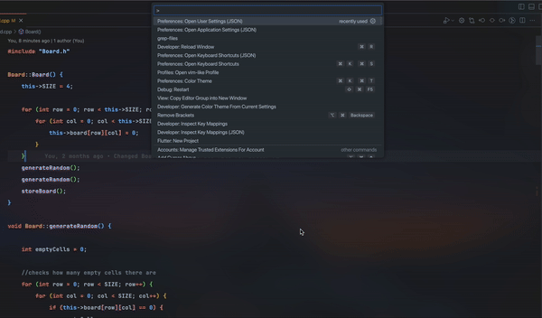

# comfy-live-grep README

This is somewhat a replica of the telescope plugin for neovim

## Features

for right now the only feature is the fuzzy finder u can run it by doing cmd+shift+p and type grep-files

For users who use the vim-mode on VSCode and want to get the same feel as the telescope on Neovim:
1. cmd+shift+p, search `Preferences: Open User Settings (JSON)`, and add the line `"vim.leader": "<space>",`
2. cmd+shift+p, search `Preferences: Open Application Settings (JSON)`, and add the lines:
    ```json
    "vim.normalModeKeyBindingsNonRecursive": [
        {
            "before": ["<leader>", "f", "f"],
            "commands": ["comfy-live-grep.grep-files"]
        }
    ]
    ``` 



<!-- \!\[feature X\]\(images/feature-x.png\) -->

<!-- > Tip: Many popular extensions utilize animations. This is an excellent way to show off your extension! We recommend short, focused animations that are easy to follow. -->

<!-- ## Requirements -->

<!-- If you have any requirements or dependencies, add a section describing those and how to install and configure them. -->

<!-- ## Extension Settings -->

<!-- Include if your extension adds any VS Code settings through the `contributes.configuration` extension point. -->

<!-- For example: -->

<!-- This extension contributes the following settings: -->

<!-- * `myExtension.enable`: Enable/disable this extension. -->
<!-- * `myExtension.thing`: Set to `blah` to do something. -->

<!-- ## Known Issues -->

<!-- Calling out known issues can help limit users opening duplicate issues against your extension. -->

<!-- ## Release Notes -->

<!-- Users appreciate release notes as you update your extension. -->

<!-- ### 1.0.0 -->

<!-- Initial release of ... -->

<!-- ### 1.0.1 -->

<!-- Fixed issue #. -->

<!-- ### 1.1.0 -->

<!-- Added features X, Y, and Z. -->

<!-- --- -->

<!-- ## Working with Markdown -->

<!-- You can author your README using Visual Studio Code.  Here are some useful editor keyboard shortcuts: -->

<!-- * Split the editor (`Cmd+\` on macOS or `Ctrl+\` on Windows and Linux) -->
<!-- * Toggle preview (`Shift+Cmd+V` on macOS or `Shift+Ctrl+V` on Windows and Linux) -->
<!-- * Press `Ctrl+Space` (Windows, Linux, macOS) to see a list of Markdown snippets -->

<!-- ## For more information -->

<!-- * [Visual Studio Code's Markdown Support](http://code.visualstudio.com/docs/languages/markdown) -->
<!-- * [Markdown Syntax Reference](https://help.github.com/articles/markdown-basics/) -->

**Enjoy!**
